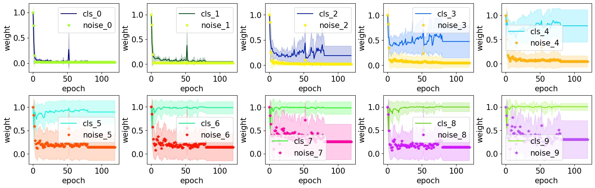

## Requirements
* Python 3
* [PyTorch](https://pytorch.org/) (version == 1.7.1)
* [yaml](https://pyyaml.org/wiki/PyYAMLDocumentation)
* [higher](https://github.com/facebookresearch/higher)(version == 0.2.1)

## Installation
``` 
shell
git clone https://github.com/MyCurveNet/CurveNet.git
cd CurveNet
cd torchlight
python setup.py install
cd ..
```
## Training

### Train our model
- In the probing stage, obtain the 
``` 
python main.py recognition_cycle -c config/cycle/cifar10_unif/train_c0.4_imb0.05.yaml
``` 
- In the allocating stage
``` 
python main.py recognition_curve -c config/aug/cifar10/train_c0.4_imb0.05.yaml
``` 

## Visualization
After training, you can visualize the weight.
``` 
python python tools/gen_fig1_weight_cls.py work_dir/recognition_cycle/cifar10_unif/cor0.4_imb0.05 work_dir/recognition_aug_cycle/cifar10_unif/cor0.4_imb0.05
``` 

<div align="center">
  
</div>

## Citation
If CurveNet is useful for your research, please consider citing:

```
@article{jiang2021delving,
  title={Delving into Sample Loss Curve to Embrace Noisy and Imbalanced Data},
  author={Jiang, Shenwang and Li, Jianan and Wang, Ying and Huang, Bo and Zhang, Zhang and Xu, Tingfa},
  journal={arXiv preprint arXiv:2201.00849},
  year={2021}
}
```
## Reference 
- The code is based on [Meta-weight-net](https://github.com/xjtushujun/meta-weight-net).
- ResNet-32 is from [MLC](https://github.com/microsoft/MLC)
